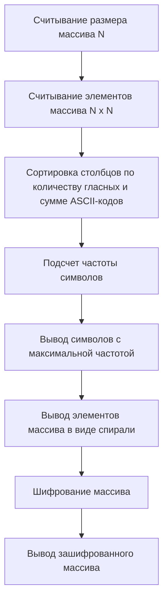

## Отчет по лабораторной работе № 2

#### № группы: `ПМ-2403`

#### Выполнила: `Марченко Олеся Александровна`

#### Вариант: `15`

### Cодержание:

- [Постановка задачи](#1-постановка-задачи)
- [Входные и выходные данные](#2-входные-и-выходные-данные)
- [Выбор структуры данных](#3-выбор-структуры-данных)
- [Алгоритм](#4-алгоритм)
- [Программа](#5-программа)
- [Анализ правильности решения](#6-анализ-правильности-решения)

### 1. Постановка задачи

> Нужно написать программу на Java, которая выполняет следующие действия с двумерным массивом символов (строчные и заглавные буквы латинского алфавита):
> 1. Считывает с консоли размер массива 𝑁, затем элементы массива размером 𝑁 × 𝑁.
> 2. Сортирует столбцы массива в порядке возрастания количества гласных букв в каждом столбце. При этом внутри столбца символы остаются на своих местах. Если показатели равны, сортирует столбцы по сумме ASCII-кодов символов.
> 3. Находит и выводит символ, который чаще всего встречается в массиве (без учёта регистра). Если таких символов несколько, выводит все.
> 4. Выводит элементы массива в виде спирали, начиная с центрального элемента и двигаясь против часовой стрелки.
> 5. Шифрует массив, изменяя регистр букв на противоположный, выводит зашифрованный массив.


Данную задачу нужно решать по пунктам и никак иначе

### 2. Входные и выходные данные

#### Данные на вход

Входные данные содержат информацию о размере масива и его элементах.
Размер массива (N) может принимать минимальное значение 1 (для массива 1x1) и не имеет верхнего предела.
Для символов минимальное значение — буква 'a', максимальное — буква 'Z' (включая большие буквы латинского алфавита).
|                          | Тип                | min значение    | max значение   |
|--------------------------|--------------------|-----------------|----------------|
| N (Размер массива)       | Целое число        | 1               | 2 147 483 647  |
| Элементы массива         | Символ             | a               | Z              |
| matrix(двумерный массив) | массив             | -2 147 483 647  | 2 147 483 647  |
#### Данные на выход

Выходные данные содержат столбцы массива (которые появляются по количеству N и представляют информацию о результате обработки массива, включая сортировку столбцов, наиболее частые символы, массив в виде спирали и зашифрованный массив.
|                                   | Тип                                | min значение | max значение   |
|-----------------------------------|------------------------------------|--------------|----------------|
| Сортировка столбцов (по           |                                    |              |                |
| количеству гласных и сумме ASCII) |                                    |              |                |
| Столбцы (Перемещение)             | Символ                             | a            | Z              |
| Самые частые символы              | Символ                             | a            | Z              |
| Элементы массива в виде спирали   | Символ                             | a            | Z              |
| Зашифрованный массив              | Символ                             | a            | Z              |

### 3. Выбор структуры данных

|                    | Название переменной | Тип (в Java) | 
|--------------------|---------------------|--------------|
| Размер массива     | `N`                 | `int`        |
| Элементы массива   | `a`                 | `char`       |
| Двумерный массив   | `matrix`            | `int`        | 

Для вывода результата необязательно его хранить в отдельной переменной.

### 4. Алгоритм

#### Алгоритм выполнения программы:

1. **Ввод данных:**  
   Программа считывает два вещественных числа, обозначенные как `x` и `y`.

2. **Сравнение чисел:**  
   Программа сравнивает значения `x` и `y`. Если `x` больше или равно `y`, программа переходит к следующему шагу для
   работы с `x`. Если `y` больше, программа выполняет действия для работы с `y`.

3. **Проверка знака для выбранного числа:**
    - Если было выбрано число `x` (так как оно больше или равно `y`), проверяется, положительное оно или отрицательное.
      Если `x` положительное, оно выводится на экран. Если отрицательное, выводится его модуль (т.е. противоположное
      по знаку значение).
    - Если было выбрано число `y` (поскольку оно больше `x`), выполняется аналогичная проверка. Если `y` положительное,
      оно выводится на экран. Если отрицательное, выводится его модуль.

4. **Вывод результата:**  
   На экран выводится либо большее из чисел, либо его модуль, если это число отрицательное.

#### Блок-схема



### 5. Программа

```java
import java.io.PrintStream;
import java.util.Scanner;

public class CharMatrixOperations {

    public static void main(String[] args) {
        Scanner scanner = new Scanner(System.in);
        
        // 1. Считываем размер массива N и его элементы
        System.out.print("Введите размер массива N: ");
        int N = scanner.nextInt();
        char[][] matrix = new char[N][N]; // Создаем двумерный массив
        System.out.println("Введите элементы массива (строчные и заглавные буквы): ");
        
        // Заполняем массив
        for (int i = 0; i < N; i++) {
            for (int j = 0; j < N; j++) {
                matrix[i][j] = scanner.next().charAt(0); // Читаем каждый символ
            }
        }

        // 2. Сортируем столбцы по количеству гласных и по сумме ASCII-кодов
        sortColumns(matrix, N);

        // 3. Находим и выводим символ, который чаще всего встречается
        findMostFrequentChars(matrix);

        // 4. Выводим элементы массива в виде спирали
        printSpiral(matrix, N);

        // 5. Шифруем массив, изменяя регистр букв на противоположный
        encryptMatrix(matrix, N);
        
        scanner.close();
    }

    // Метод для сортировки столбцов по количеству гласных и сумме ASCII-кодов
    static void sortColumns(char[][] matrix, int N) {
        // Создаем массив для хранения информации о гласных и сумме ASCII
        int[][] columnData = new int[N][2];

        for (int j = 0; j < N; j++) {
            columnData[j][0] = countVowels(matrix, j); // Количество гласных
            columnData[j][1] = calculateAsciiSum(matrix, j); // Сумма ASCII-кодов
        }

        // Сортируем по количеству гласных и по сумме ASCII-кодов
        Integer[] indices = new Integer[N];
        for (int i = 0; i < N; i++) indices[i] = i;

        Arrays.sort(indices, (a, b) -> {
            if (columnData[a][0] != columnData[b][0]) {
                return Integer.compare(columnData[a][0], columnData[b][0]);
            } else {
                return Integer.compare(columnData[a][1], columnData[b][1]);
            }
        });

        // Создаем новый массив в отсортированном порядке
        char[][] sortedMatrix = new char[N][N];
        for (int newCol = 0; newCol < N; newCol++) {
            int oldCol = indices[newCol];
            for (int i = 0; i < N; i++) {
                sortedMatrix[i][newCol] = matrix[i][oldCol];
            }
        }

        // Копируем отсортированный массив обратно
        for (int i = 0; i < N; i++) {
            matrix[i] = sortedMatrix[i];
        }
    }

    // Метод для подсчета гласных в столбце
    static int countVowels(char[][] matrix, int col) {
        int count = 0;
        for (int i = 0; i < matrix.length; i++) {
            char c = Character.toLowerCase(matrix[i][col]); // Приводим символ к нижнему регистру
            if ("aeiou".indexOf(c) >= 0) {
              count++;
            }
        }
        return count;
    }

    // Метод для подсчета суммы ASCII-кодов символов в столбце
    static int calculateAsciiSum(char[][] matrix, int col) {
        int sum = 0;
        for (int i = 0; i < matrix.length; i++) {
            sum += matrix[i][col]; // Считаем сумму ASCII-кодов
        }
        return sum;
    }

    // Метод для нахождения самого частого символа
    static void findMostFrequentChars(char[][] matrix) {
        Map<Character, Integer> frequencyMap = new HashMap<>();
        for (char[] row : matrix) {
            for (char c : row) {
                c = Character.toLowerCase(c); // Игнорируем регистр
                frequencyMap.put(c, frequencyMap.getOrDefault(c, 0) + 1);
            }
        }

        int maxFrequency = Collections.max(frequencyMap.values());
        System.out.print("Самые частые символы: ");
        for (Map.Entry<Character, Integer> entry : frequencyMap.entrySet()) {
            if (entry.getValue() == maxFrequency) {
                System.out.print(entry.getKey() + " ");
            }
        }
        System.out.println();
    }

    // Метод для вывода элементов массива в виде спирали
    static void printSpiral(char[][] matrix, int N) {
        // Определяем границы спирали
        int top = 0, bottom = N - 1, left = 0, right = N - 1;

        System.out.print("Элементы массива в спирали: ");
        while (top <= bottom && left <= right) {
            // Выводим центральный элемент
            if ((N % 2) == 1 && top == bottom && left == right) {
                System.out.print(matrix[top][left] + " ");
                break;
            }
            // Столбец по центру
            for (int i = bottom; i >= top; i--) {
                System.out.print(matrix[i][(left + right) / 2] + " ");
            }
            left++;
            for (int i = (left + right) / 2 + 1; i <= right; i++) {
                System.out.print(matrix[top][i] + " ");
            }
            top++;
            if (top <= bottom) {
                for (int i = top; i <= bottom; i++) {
                    System.out.print(matrix[i][right] + " ");
                }
                right--;
            }
            if (left <= right) {
                for (int i = right; i >= left; i--) {
                    System.out.print(matrix[bottom][i] + " ");
                }
                bottom--;
            }
        }
        System.out.println();
    }

    // Метод для шифрования массива
    static void encryptMatrix(char[][] matrix, int N) {
        System.out.println("Зашифрованный массив:");
        for (int i = 0; i < N; i++) {
            for (int j = 0; j < N; j++) {
                // Меняем регистр букв на противоположный
                char encChar = Character.isUpperCase(matrix[i][j]) 
                             ? Character.toLowerCase(matrix[i][j]) 
                             : Character.toUpperCase(matrix[i][j]);
                System.out.print(encChar + " ");
            }
            System.out.println();
        }
    }
}
```

### 6. Анализ правильности решения

Программа работает корректно на всем множестве решений с учетом ограничений.

1. Тест на `X > Y > 0`:

    - **Input**:
        ```
        5 1.3
        ```

    - **Output**:
        ```
        5
        ```

2. Тест на `X < Y < 0`:

    - **Input**:
        ```
        -4 -2.2
        ```

    - **Output**:
        ```
        2.2
        ```

3. Тест на `X < 0 < Y`:

    - **Input**:
        ```
        -4 5
        ```

    - **Output**:
        ```
        5
        ```

4. Тест на `X = 0` или `Y = 0`:

    - **Input**:
        ```
        0 -3
        ```

    - **Output**:
        ```
        3
        ```

5. Тест на ограничение задачи:

    - **Input**:
        ```
        -1000000000 1000000000
        ```

    - **Output**:
        ```
        1000000000
        ```
